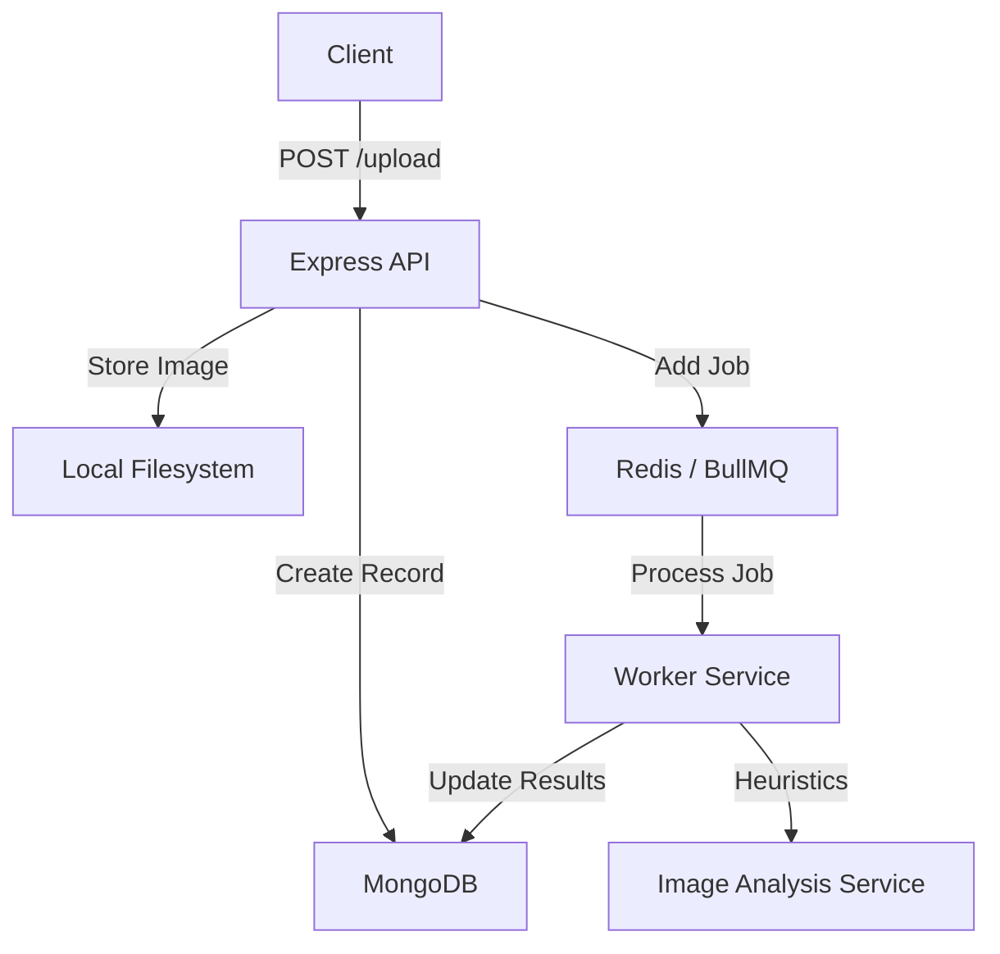
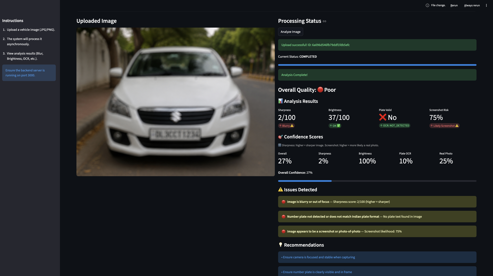
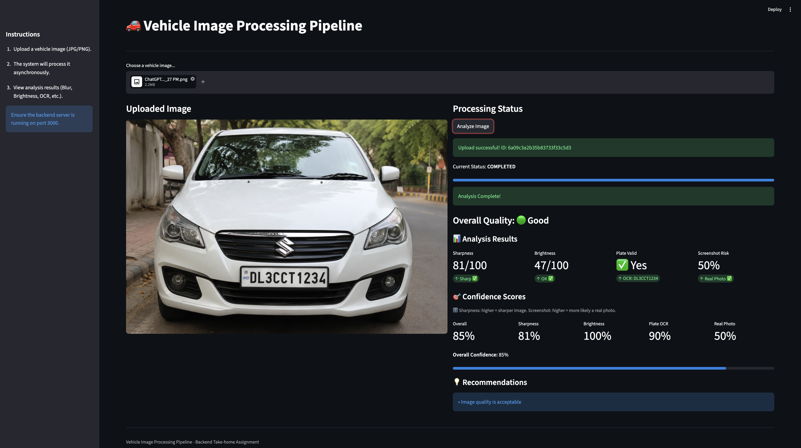

# Vehicle Image Processing Pipeline

A backend-focused vehicle image processing pipeline built with Node.js, Express, BullMQ, Redis, and MongoDB. This project demonstrates clean architecture, asynchronous processing, and heuristic-based AI analysis.

## Architecture Overview

The system uses a producer-consumer architecture:
1.  **API (Producer)**: Receives image uploads, stores them locally, and adds a job to the Redis-backed queue (BullMQ).
2.  **Worker (Consumer)**: Processes images asynchronously, performing multiple heuristic checks and storing results in MongoDB.



## Features & Heuristics

### 1. Async Processing
- **BullMQ**: Reliable job processing with Redis.
- **Retries**: 3 maximum retries with exponential backoff.
- **States**: `pending`, `processing`, `completed`, `failed`.

### 2. Image Analysis Heuristics
- **Blur Detection**: Laplacian variance calculation. High variance indicates a sharp image.
- **Brightness Analysis**: Average pixel intensity stats via Sharp.
- **Duplicate Detection**: Perceptual hashing (pHash) via `imghash` to identify similar images.
- **OCR & Validation**: Tesseract.js for extracting Indian number plate text with regex validation (`^[A-Z]{2}[0-9]{1,2}[A-Z]{1,2}[0-9]{4}$`).
- **Screenshot Detection**: Heuristic-based checks using EXIF metadata, aspect ratios, and format analysis.

### 3. Confidence Scores
Generates scores (0-100) based on heuristic outcomes to provide a reliability metric for each analysis.

## Tech Stack
- **Backend**: Node.js, Express.js
- **Queue**: BullMQ, Redis
- **Database**: MongoDB
- **Image Processing**: Sharp, Image-js, Tesseract.js, Imghash
- **Logging**: Winston

## Setup Instructions

### Prerequisites
- Docker & Docker Compose
- Node.js (v18+)

### Running Application
1.  **Start Infrastructure**: Ensure Docker is running and start containers.
    ```bash
    docker-compose up -d
    ```
2.  **Start Backend**:
    ```bash
    npm run dev
    ```
3.  **Start Frontend**:
    Open a new terminal and run:
    ```bash
    cd frontend
    pip install -r requirements.txt
    streamlit run app.py
    ```

## API Documentation

### POST `/api/upload`
Upload a vehicle image.
- **Field**: `vehicle_image` (File)
- **Response**: `202 Accepted`
```json
{
  "message": "Upload successful, processing started",
  "processing_id": "645a..."
}
```

### GET `/api/status/:id`
Check the status of a processing job.
```json
{
  "id": "645a...",
  "status": "completed",
  "retry_count": 0,
  "timestamp": "2026-05-16..."
}
```

### GET `/api/results/:id`
Get full analysis results.
```json
{
  "id": "645a...",
  "filename": "vehicle-123.jpg",
  "results": {
    "blur_score": 450.2,
    "brightness_score": 128.5,
    "ocr_text": "MH12AB1234",
    "plate_valid": true,
    "confidence_scores": {
      "overall": 85,
      "blur": 90,
      "brightness": 100,
      "ocr": 100,
      "screenshot": 100
    }
  }
}
```

## AI Usage Disclosure
Heuristics and architecture patterns were designed with AI assistance to ensure adherence to best practices while maintaining simplicity.

## Trade-offs & Future Improvements
- **Duplicate Detection**: Currently generates pHash; a production system would use a distance threshold (Hamming distance) across the database.
- **OCR Accuracy**: Tesseract.js is great for general text; a specialized license plate recognition (LPR) model would yield better results.
- **Storage**: Images are stored locally; production should use S3 or similar.
## Test Preview


